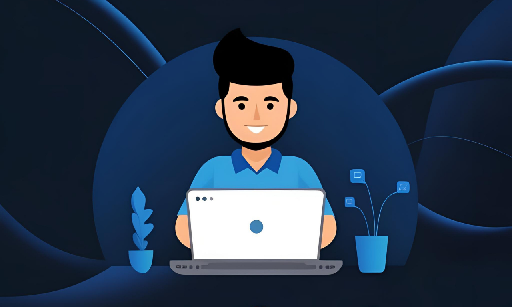

<h2 align="center"> Hi there 👋 I am Monirul Islam</h2> 
<h3 align="center">Experienced in WordPress and Laravel Development</h3>

Experienced Web Developer with WordPress, PHP, Laravel, JavaScript, and Vue JS expertise. Passionate about creating dynamic, responsive, and high-performance web applications with clean and efficient code. Skilled in custom WordPress development, Laravel backend solutions, and front-end design, ensuring seamless user experiences. Adept at troubleshooting, optimizing website performance, and delivering projects on time.

<h2>Get in touch with me</h2>
<ul ;">
  <li>💼 [LinkedIn](https://www.linkedin.com/in/monirul909/)</li>
  <li>🌐</li>
  <li>🌐</li>
  <li>🌐</li>
  <li>🌍 Faridpur, Dhaka, Bangladesh</li>
</ul>

<!--
**monirulislam909/monirulislam909** is a ✨ _special_ ✨ repository because its `README.md` (this file) appears on your GitHub profile.

